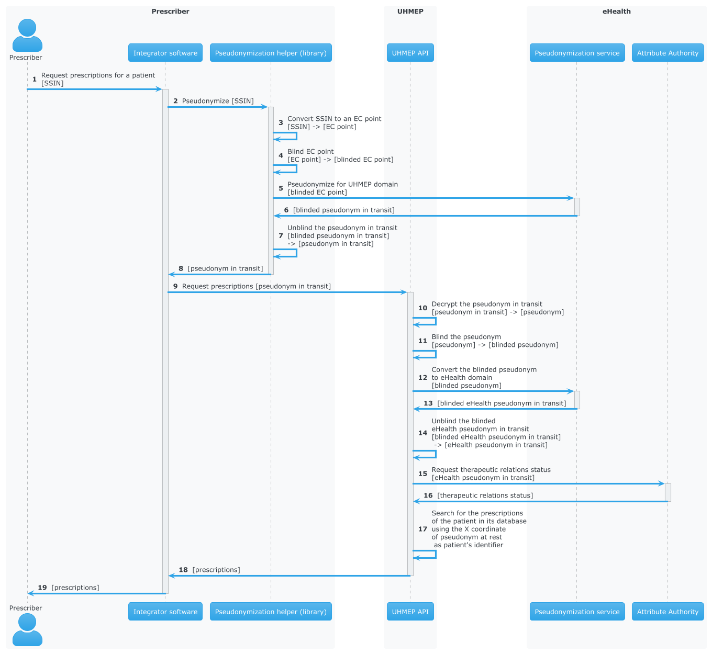

= Smals Pseudonymisation Helper
:author: Steve Van Reeth <steve.vanreeth@smals.be>
:version: 0.1
:lang: en
:icons: font
:toc:
:toc-placement!:

:links-ehealth-doc: https://portal.api.ehealth.fgov.be/api-details?apiId=eb8015c0-693b-4c4f-bab9-f671d35ddc15&managerId=1&Itemid=171&catalogModuleId=120[eHealth Pseudonymisation service]

toc::[]

== Introduction

The goal of this document is to describe the Smals Pseudonymisation Helper Java library, which helps to use the {links-ehealth-doc}, and how to integrate it into your projects.

It also helps to understand the different concepts of pseudonymisation.

This document is intended to be useful to everyone, whether you are in a functional or technical role.

== Prerequisite

It is strongly recommended to read the {links-ehealth-doc} documentation before reading this document.

== Definitions

[discrete]
=== Identifier

[%collapsible]
====
An identifier is a unique code that identifies a citizen without requiring additional information.
The most common identifier in Belgium is the social security number (rijksregisternummer/numéro de registre national).
The eHealth Pseudonymisation service only exchanges elliptic curve points, not identifiers.
Each identifier must be converted to an elliptic curve point before exchange.
Conversely, an elliptic curve point must be converted into an identifier before it can be used by the user/system.
====

[discrete]
=== EC point (Elliptic Curve point)

[%collapsible]
====
Point on an elliptic curve.
The elliptic curve used by the eHealth Pseudonymisation service is P-521.
====

[discrete]
=== Blinding

[%collapsible]
====
An EC point is 'blinded' if it has been modified before being sent and if it cannot be found or seen by another user/system.
Only the user/system that blinded the EC point can unblind it, as he is the only one who knows how to unblind it.
It can be seen as encryption with a private single-use key.
Blinding an EC point ensures that nobody can map an identifier to a pseudonym at rest, or a pseudonym from one domain to a pseudonym from another domain.
====

[discrete]
=== Pseudonym (at rest)

[%collapsible]
====
A pseudonym is an EC point associated with one citizen in a specific domain (see below).
Hence, pseudonyms have only local significance.
This means that a pseudonym does not allow someone to know the real citizen behind it without additional information.
eHealth converts (pseudonymises) an EC point into a pseudonym by applying a complex operation on the EC point.
This operation is securely done by an HSM (Hardware Security Module) that knows which operation to apply to the EC points.
The HSM is also used to revert the operation: to convert (identify) a pseudonym into an EC point.
Sensitive data can be linked together using this local pseudonym, but it is not sufficient to link this data to the real person outside of this domain.
Sensitive data must of course be encrypted if it contains information that can help to identify the real person outside of this domain.
A pseudonym enables the linkage of records belonging to the same citizen, without the need to identify the real citizen behind it.
The pseudonym can be stored in a database or any secure storage system, but it cannot be exchanged with external users/systems.
====

[discrete]
=== Pseudonym in transit

[%collapsible]
====
A pseudonym in transit is a pseudonym with extra protection layer that are only present during transit.
By 'transit', we mean during the exchange of this pseudonym from one system/person to another system/person.
====

[discrete]
=== Domain

[%collapsible]
====
A domain is a set of pseudonymised data, meaning a domain consists of multiple records in the form of pseudonym-data.
Each pseudonym is associated with a single domain and has meaning only within that domain.
A domain could be a specific backend database or a pseudonymised dataset required for a specific research project.
Domains should never overlap.
Hence, domains can be thought of as separate islands; on each island, the citizen is known only by their island-specific pseudonym.
====

== Use case example

This section aims to explain the use of pseudonymisation in a real use case.
It will focus on the manipulation of the patient identifier and the returned data.
This means that it will list the operations to apply on the identifier/data, but it will not explain how the library will do it technically.

In this example, a prescriber will consult prescriptions for a patient using an integrator software.
The back-end (called UHMEP in our example) will call an external eHealth service (Attribute Authority) to verify the therapeutic relations (therapeutic link + exclusion) to determine if the prescriptions can be returned.
Once this check is done, the prescriptions will be returned to the prescriber.
An explanatory text of the diagram is present just after it.

1-2::
The patient identifier cannot be given to the back-end application.
The integrator software will then use the library to pseudonymise the identifier, which is the Belgian Social Security Identification Number (SSIN), into a pseudonym in transit for the domain of the targeted back-end (UHMEP API in this case).

3-8::
The library will convert this identifier to a point on the elliptic curve (EC point), blind this EC point, and call the `pseudonymize` operation of the eHealth Pseudonymisation service.
The response will be unblinded and returned to the software.
Blinding is necessary for each call to the eHealth Pseudonymisation service to prevent this service from seeing any kind of patient identifier (SSIN, pseudonym at rest).

9::
The pseudonym in transit returned by the library can be used to request prescriptions from the back-end.

10::
This pseudonym in transit will be decrypted by the back-end to remove the protection layer present during data exchange.
The result of this decryption is called the pseudonym at rest, which will be stored in the back-end database.
This pseudonym at rest will always be the same if the patient identifier is the same, which is not the case for the pseudonym in transit: it will always be different.

11-17::
This pseudonym at rest can be used to retrieve the patient's prescriptions, but first, the back-end needs to verify if those prescriptions can be consulted by the prescriber by checking the therapeutic relations.
To do this, the back-end must call an external eHealth service and communicate for which patient the verification must be done.
This will be done by providing a pseudonym in transit for the domain "eHealth".
To obtain this pseudonym, the back-end converts its pseudonym at rest to a pseudonym in transit for eHealth.
Once the verification is done, the back-end can return the prescriptions with a new pseudonym in transit for the patient information (by encrypting the pseudonym at rest).

18::
The integrator software can use the library to link this pseudonym in transit to the original identifier.
In this case, this last call is not necessary but will be if the prescriber consults prescriptions he created and then receives prescriptions for many patients.

== VAS library integration (Maven)

To add the Pseudonymisation Helper library in your project, you can add this Maven dependency in your POM:

[source,xml,indent=0]
----
<dependency>
  <groupId>be.smals.shared.pseudo</groupId>
  <artifactId>pseudo-helper</artifactId>
  <version>0.1.0</version>
</dependency>
----

This library has some dependencies:

[source,xml,indent=0]
----
<dependency>
  <groupId>org.bouncycastle</groupId>
  <artifactId>bcprov-jdk18on</artifactId>
  <version>${bouncycastle.version}</version>
  <scope>compile</scope>
</dependency>

----

This library also contains a shaded version of the `com.nimbusds:nimbus-jose-jwt` dependency.
Since it is shaded, it acts as an isolated dependency and will not interfere with any version of `com.nimbusds:nimbus-jose-jwt` that you might include in your project.

== Initialization PseudonymisationHelper

PseudonymisationHelper is initialized using a builder which requires specific parameters to be provided.
This guide outlines the steps and parameters needed for a successful initialization.

[discrete]
=== Parameters

Ensure that you have the required parameters for initialization:

[%autowidth]
|===
| Name | Type | Description

| *pseudonymisationClient*
| `PseudonymisationClient`
| The `PseudonymisationClient` to use to make calls to eHealth Pseudonymisation service.

| jwksUrl
| `URI`
a| The JSON Web Key Set URL used by eHealth Pseudonymisation service to encrypt the domaim secret keys. It **must** be exactly the URL defined in eHealth Pseudonymisation service.

TIP: If you are not sure about the URL referenced in eHealth Pseudonymisation service, you can use your `PseudonymisationClient` to retrieve your domain, and check your JSON Web Key Set URL.

| jwksSupplier
| `Supplier<CompletableFuture<String>>`
| A Supplier of the JSon Web Key Set (as String) pointed by `jwksUrl`.

| privateKeySupplier
| `PrivateKeySupplier`
| The `PrivateKeySupplier` to use to decrypt the secret keys of the domain. In other words, it supplies the private keys that are defined in the JWKS supplied by `jwksSupplier`.

|===

[TIP]
====
Only `pseudonymisationClient` is mandatory in all use cases.

When you need to encrypt or decrypt pseudonyms in transit (in other words: if you are the owner of at least one domain), you also have to provide `jwksUrl`, `jwksSupplier` and `privateKeySupplier`.

For example, the software of a physician only needs to provide `pseudonymisationClient`.
====

[discrete]
=== Code snippet

.PseudonymizationHelper initialization example
[source,java]
----
var helper =
    PseudonymisationHelper
        .builder()
        .jwksUrl(new URI("https://api.ehealth.fgov.be/etee/v1/pubKeys/cacerts/jwks?identifier=0406798006&type=CBE&applicationIdentifier=UHMEP&use=enc"))
        .jwkSupplier( () -> "...")
        .pseudonymisationClient(
            new PseudonymisationClient() {
              @Override
              public CompletableFuture<String> getDomain(final String domainKey) {
                // Add your implementation here
              }
              @Override
              public CompletableFuture<String> identify(final String domainKey, final String payload) {
                // Add your implementation here, if needed
              }
              @Override
              public CompletableFuture<String> identifyMultiple(final String domainKey, final String payload) {
                // Add your implementation here, if needed
              }
              @Override
              public CompletableFuture<String> pseudonymize(final String domainKey, final String payload) {
                // Add your implementation here, if needed
              }
              @Override
              public CompletableFuture<String> pseudonymizeMultiple(final String domainKey, final String payload) {
                // Add your implementation here, if needed
              }
              @Override
              public CompletableFuture<String> convertTo(final String fromDomainKey,
                                                         final String toDomainKey,
                                                         final String payload) {
                // Add your implementation here, if needed
              }
              @Override
              public CompletableFuture<String> convertMultipleTo(final String fromDomainKey,
                                                                 final String toDomainKey,
                                                                 final String payload) {
                // Add your implementation here, if needed
              }
            })
        .privateKeySupplier( domainKey -> "...")
        .build();
----

[TIP]
====
You only have to implement the methods of PseudonymisationClient that you really need.
If you only need to pseudonymise and identify single values, then you only have to implement identify() and pseudonymize().
The only method that is mandatory is getDomain().
====

.Methods of PseudonymizationClient
[%collapsible]
====
[source,java,indent=0]
----
/**
 * Calls /pseudo/v1/domains/{domainKey} and returns a {@link Future} of the response as a String.
 * 

 * Each call to this method <strong>must</strong> make a call to eHealth pseudonymisation service: please do not return a cached response !
 *
 * @param domainKey the domain key
 * @return the response as a String
 */
CompletableFuture<String> getDomain(String domainKey);

/**
 * Calls /pseudo/v1/domains/{domainKey}/identify with the given payload and returns a {@link Future} of the response as a String.
 *
 * @param domainKey the domain key
 * @param payload   the request body
 * @return the response as a String
 */
default CompletableFuture<String> identify(final String domainKey, final String payload) {
  throw new UnsupportedOperationException();
}

/**
 * Calls /pseudo/v1/domains/{domainKey}/identifyMultiple with the given payload and returns a {@link Future} of the response as a String.
 *
 * @param domainKey the domain key
 * @param payload   the request body
 * @return the response as a String
 */
default CompletableFuture<String> identifyMultiple(final String domainKey, final String payload) {
  throw new UnsupportedOperationException();
}

/**
 * Calls /pseudo/v1/domains/{domainKey}/pseudonymize with the given payload and returns a {@link Future} of the response as a String.
 *
 * @param domainKey the domain key
 * @param payload   the request body
 * @return the response as a String
 */
default CompletableFuture<String> pseudonymize(final String domainKey, final String payload) {
  throw new UnsupportedOperationException();
}

/**
 * Calls /pseudo/v1/domains/{domainKey}/pseudonymizeMultiple with the given payload and returns a {@link Future} of the response as a String.
 *
 * @param domainKey the domain key
 * @param payload   the request body
 * @return the response as a String
 */
default CompletableFuture<String> pseudonymizeMultiple(final String domainKey, final String payload) {
  throw new UnsupportedOperationException();
}

/**
 * Calls /pseudo/v1/domains/{fromDomainKey}/convertTo/{toDomainKey} with the given payload and returns a {@link Future} of the response as a String.
 *
 * @param fromDomainKey the domain of the pseudonym to convert
 * @param toDomainKey   the target domain
 * @param payload       the request body
 * @return the response as a String
 */
default CompletableFuture<String> convertTo(final String fromDomainKey, final String toDomainKey, final String payload) {
  throw new UnsupportedOperationException();
}

/**
 * Calls /pseudo/v1/domains/{fromDomainKey}/convertMultipleTo/{toDomainKey} with the given payload and returns a {@link Future} of the response as a String.
 *
 * @param fromDomainKey the domain of the pseudonym to convert
 * @param toDomainKey   the target domain
 * @param payload       the request body
 * @return the response as a String
 */
default CompletableFuture<String> convertMultipleTo(final String fromDomainKey, final String toDomainKey, final String payload) {
  throw new UnsupportedOperationException();
}
----
====

== Explanation of PseudonymisationHelper

`PseudonymisationHelper` primarily provides `Domain` instances, which are essentially sets of factories that allow you to create different objects you can manipulate to apply pseudonymisation operations.

The first step after the initialization is to retrieve a domain.

`getDomain()` will use the `PseudonmymisationClient` you provided in the constructor to call eHealth Pseudonymisation service.
This call is asynchronous and that's why it returns a `CompletableFuture<Domain>`.

[TIP]
====
Your `PseudonmymisationClient` must call eHealth Pseudonymisation service for the domains you need to encrypt/decrypt transitInfo.
For the other domains, your `PseudonmymisationClient` should return a hardcoded representation of the domain.

.Exemple with hardcoded `ehealth_v1` domain
[source,java]
----
public class MyPseudonymisationClient implements PseudonymisationClient {
  @Override
  public CompletableFuture<String> getDomain(final String domainKey) {
    if (domainKey.equals("ehealth_v1")) {
      return CompletableFuture.completedFuture(
          "{\n" +
          "  \"audience\": \"https://api.ehealth.fgov.be/pseudo/v1/domains/ehealth_v1\",\n" +
          "  \"bufferSize\": 8,\n" +
          "  \"timeToLiveInTransit\": \"PT10M\",\n" +
          "  \"domain\": \"ehealth_v1\"\n" +
          "}");
    }
    // Add here your implementation that calls eHealth Pseudonymisation service
  }
}
----

====

.Exemple that retrieve the `uhmep_v1` domain
[source,java]
----
Domain domain = pseudonymisationHelper.getDomain("uhmep_v1").get();
----

Main classes used by the library as parameter or return types are described bellow.

=== Domain

The Domain object represents your or a foreign Domain. The object contains methods to access to the factory.

.Methods
[source,java,indent=0]
----
/**
 * Returns the key of this domain.
 *
 * @return the key of this domain
 */
String key();

/**
 * Returns the {@link ValueFactory} of this domain.
 *
 * @return the {@link ValueFactory} of this domain
 */
ValueFactory valueFactory();

/**
 * Returns the {@link PseudonymFactory} of this domain.
 *
 * @return the {@link PseudonymFactory} of this domain
 */
PseudonymFactory pseudonymFactory();

/**
 * Returns the {@link PseudonymInTransitFactory} of this domain.
 *
 * @return the {@link PseudonymInTransitFactory} of this domain
 */
  PseudonymInTransitFactory pseudonymInTransitFactory();
----

=== ValueFactory

The ValueFactory allows the creation of `Value` objects, such as a clear identifier to be pseudonymised.
It serves as the entry point to pseudonymise an identifier or a string, or as the output when a pseudonym is identified (de-pseudonymised).

IMPORTANT: Even though it is technically possible to have values longer than 32 bytes, eHealth requires that this 32-byte limit is not exceeded.

.Methods
[source,java,indent=0]
----
  /**
   * Creates a {@link Value} from the given array of bytes.
   *
   * @param value Raw value to convert to {@link Value}.
   * @return the {@link Value} for the given array of bytes
   * @throws InvalidValueException If the value cannot be converted to a {@link Value} (if the value is too long).
   */
  Value from(byte[] value) throws InvalidValueException;

  /**
   * Creates a {@link Value} from the given String.
   * 

   * The string will be internally converted to an array of bytes using the given {@link Charset}.
   * 

   * Use it for strings on which you want to control which {@link Charset} must be used to convert this string into bytes.
   * The main advantage is to limit the number of bytes used if you use a single-byte character set (like ISO 8859-1 (Latin-1), Windows-1252 or ASCII).
   * Keep in mind that eHealth asks not to pseudonymise data with a length exceeding 32 bytes.
   *
   * @param value String to convert to {@link Value}.
   * @return the {@link Value} for the given array of bytes
   * @throws InvalidValueException If the value cannot be converted to a Value (if the value is too long).
   */
  Value from(final String value, final Charset charset) throws InvalidValueException;

  /**
   * Creates a {@link Value} from the given String.
   * 

   * The string will be internally converted to an array of bytes using UTF-8 {@link Charset}.
   *
   * @param value String to convert to {@link Value}.
   * @return the {@link Value} for the given array of bytes
   * @throws InvalidValueException If the value cannot be converted to a Value (if the value is too long).
   */
  Value from(final String value) throws InvalidValueException;

  /**
   * Create an empty {@link MultipleValue}.
   *
   * @return an empty {@link MultipleValue}.
   */
  MultipleValue multiple();

  /**
   * Create a {@link MultipleValue} containing the items of the given {@link Collection}.
   * 

   * The items (references) of the given collection are copied to returned {@link MultipleValue}.
   * Changes done on the collection will not be reflected on the returned {@link MultipleValue}.
   *
   * @param values {@link Collection} of items to copy in the returned {@link MultipleValue}
   * @return a {@link MultipleValue} containing the items of the given {@link Collection}
   */
  MultipleValue multiple(Collection<Value> values);
----

=== PseudonymFactory

The PseudonymFactory is responsible for creating Pseudonym objects from points on the curve X and Y.
If the point is invalid then InvalidPseudonymException is raised.

When you store a pseudonym from your persistent system (database, for example), you should store the X coordinate of the point, and use the PseudonymFactory to create the Pseudonym from the X coordinate.
If, for performance reasons, you also store the Y coordinate in your persistence system, then you can also provide it to the PseudonymFactory: this will avoid computing the Y coordinate and will save a substantial amount of CPU resources.

[WARNING]
====
If you don't have perfonance issues in computing the Y coodrinate, it is recommanded to only store the X coordinate in your persistence system.

If you decide to store the Y coordinate in your persistence system, you should not define the X-Y pair as a unique identifier: only the X should be used as an identifier because you have no guarantee that the user who will call your API will provide the same Y coordinate you stored in your persistence system.
====

.Methods
[source,java,indent=0]
----
  /**
   * Create a {@link Pseudonym} from the given X coordinate.
   * 

   * The Y coordinate will be computed and one of the two possible values will be randomly chosen.
   * The Y coordinate can be chosen randomly because only the X is important in the context of eHealth pseudonymisation.
   *
   * @param xAsBase64String Base64 string representation of the X coordinate.
   * @return a {@link Pseudonym} having the given X coordinate.
   * @throws InvalidPseudonymException If the coordinates or the format are invalid.
   */
  Pseudonym fromX(String xAsBase64String) throws InvalidPseudonymException;

  /**
   * Create a {@link Pseudonym} from the given coordinates.
   *
   * @param xAsBase64String Base64 string representation of the X coordinate.
   * @param yAsBase64String Base64 string representation of the Y coordinate.
   * @return Pseudonym
   * @throws InvalidPseudonymException If the coordinates or the format are invalid.
   */
  Pseudonym fromXY(String xAsBase64String, String yAsBase64String) throws InvalidPseudonymException;

  /**
   * Create an empty {@link MultiplePseudonym}.
   *
   * @return an empty {@link MultiplePseudonym}.
   */
  MultiplePseudonym multiple();

  /**
   * Create a {@link MultiplePseudonym} containing the items of the given {@link Collection}.
   * 

   * The items (references) of the given collection are copied to returned {@link MultiplePseudonym}.
   * Changes done on the collection will not be reflected on the returned {@link MultiplePseudonym}.
   *
   * @param pseudonyms {@link Collection} of items to copy in the returned {@link MultiplePseudonym}
   * @return a {@link MultiplePseudonym} containing the items of the given {@link Collection}
   */
  MultiplePseudonym multiple(Collection<Pseudonym> pseudonyms);
----

=== PseudonymInTransitFactory

This factory allows to create PseudonymInTransit objects from a pseudonym and a transitInfo.

.Methods
[source,java,indent=0]
----
  /**
   * Creates a {@link PseudonymInTransit} from the given coordinates, and transit info.
   *
   * @param x           Base64 string representation of the X coordinate.
   * @param y           Base64 string representation of the Y coordinate.
   * @param transitInfo the standard JWE compact representation (Base64 URL encoded String) of the transitInfo
   *                    which contains the scalar that will be used to unblind the given {@link Pseudonym}.
   * @return A {@link PseudonymInTransit} created from the given coordinates and transit info
   */
  PseudonymInTransit fromXYAndTransitInfo(final String x, final String y, final String transitInfo) throws InvalidPseudonymException;

  /**
   * Creates a {@link PseudonymInTransit} from the given SEC 1 representation of the elliptic curve point and transit info.
   *
   * @param sec1AndTransitInfo Base64 URL string representation (without padding) of the SEC 1 encoded point
   *                           (can be SEC 1 compressed or uncompressed format),
   *                           followed by {@code :},
   *                           and by the standard JWE compact representation (Base64 URL encoded String) of the transitInfo
   *                           which contains the scalar that will be used to unblind the given point coordinates (pseudonym).
   * @return A {@link PseudonymInTransit} created from the given {@code sec1AndTransitInfo}
   * @throws InvalidPseudonymException if the format of the given {@code sec1AndTransitInfo} is invalid
   */
  PseudonymInTransit fromSec1AndTransitInfo(final String sec1AndTransitInfo) throws InvalidPseudonymException;

  /**
   * Create an empty {@link MultiplePseudonymInTransit}.
   *
   * @return an empty {@link MultiplePseudonymInTransit}.
   */
  @SuppressWarnings("unused")
  MultiplePseudonymInTransit multiple();

  /**
   * Create a {@link MultiplePseudonymInTransit} containing the items of the given {@link Collection}.
   * 

   * The items (references) of the given collection are copied to returned {@link MultiplePseudonymInTransit}.
   * Changes done on the collection will not be reflected on the returned {@link MultiplePseudonymInTransit}.
   *
   * @param pseudonymsInTransit {@link Collection} of items to copy in the returned {@link MultiplePseudonymInTransit}
   * @return a {@link MultiplePseudonymInTransit} containing the items of the given {@link Collection}
   */
  @SuppressWarnings("unused")
  MultiplePseudonymInTransit multiple(Collection<PseudonymInTransit> pseudonymsInTransit);
----

=== Value

A Value object represents a clear identifier, this object allows to pseudonymize an identifier.

.Methods
[source,java,indent=0]
----
  /**
   * Returns the value as a bytes array.
   * 

   * Use it for non-text values.
   *
   * @return the value as a bytes array
   */
  byte[] asBytes();

  /**
   * Returns the value as a String.
   * 

   * Convenient method that converts the bytes array to a String.
   * 

   * Use it only for text values for which you called {@link ValueFactory#from(String, Charset)}.
   *
   * @param charset The charset to use to convert the internal bytes array to a String.
   * @return the value as a String
   */
  String asString(final Charset charset);

  /**
   * Returns the value as a String.
   * 

   * Convenient method that converts the bytes array (representing UTF-8 characters) to a String.
   * 

   * Use it for text values.
   *
   * @return the value as a String
   */
  String asString();

  /**
   * Returns this {@link Value} as a {@link Pseudonym}.
   * 

   * Should not be used in regular usage, but it can be convenient for testing/logging purpose.
   *
   * @return this {@link Value} as a {@link Pseudonym}.
   */
  Pseudonym asPseudonym();

  /**
   * Pseudonymize this {@link Value}.
   *
   * @return a random {@link PseudonymInTransit} for this {@link Value}.
   */
  CompletableFuture<? extends PseudonymInTransit> pseudonymize();
----

=== Pseudonym

A Pseudonym object represents a point X and Y in a curve.

.Methods
[source,java,indent=0]
----
  /**
   * Returns binary representation of the X coordinate (as a byte array converted in a Base64 String).
   *
   * @return binary representation of the X coordinate (as a byte array converted in a Base64 String)
   */
  String x();

  /**
   * Returns binary representation of the Y coordinate (as a byte array converted in a Base64 String).
   *
   * @return binary representation of the Y coordinate (as a byte array converted in a Base64 String)
   */
  String y();

  /**
   * Base64 URL encoded uncompressed SEC1 Elliptic-Curve-Point-to-Octet-String Conversion of this point.
   *
   * @return Base64 URL encoded the uncompressed SEC1 Elliptic-Curve-Point-to-Octet-String Conversion of this point
   */
  String sec1();

  /**
   * Compressed SEC 1 representation of this point.
   *
   * @return compressed SEC 1 representation of this point
   */
  String sec1Compressed();

  /**
   * Convert this {@link Pseudonym} into a {@link PseudonymInTransit} for the given domain.
   *
   * @param toDomain the target domain for the returned {@link PseudonymInTransit}
   * @return a {@link PseudonymInTransit} for the given domain, matching this {@link Pseudonym}
   */
  CompletableFuture<? extends PseudonymInTransit> convertTo(Domain toDomain);

  /**
   * Create a {@link PseudonymInTransit} from this {@link Pseudonym}.
   * 

   * Use this method to convert a pseudonym at rest into a {@link PseudonymInTransit} that you can send externally.
   * 

   * The scalar in transitInfo is encoded in Base64.
   *
   * @return a {@link PseudonymInTransit} with X and Y blinded by a scalar (which is encrypted and put in transitInfo)
   */
  PseudonymInTransit inTransit();

  /**
   * Create a {@link PseudonymInTransit} from this {@link Pseudonym}.
   * 

   * Use this method to convert a pseudonym at rest into a {@link PseudonymInTransit} that you can send externally.
   * 

   * The scalar in transitInfo is encoded in Base64.
   * 

   * The given {@link TransitInfoCustomizer} allows you to add header parameters and payload properties
   * in the {@link TransitInfo} of the returned {@link PseudonymInTransit}.
   *
   * @return a {@link PseudonymInTransit} with X and Y blinded by a scalar (which is encrypted and put in transitInfo)
   */
  PseudonymInTransit inTransit(final TransitInfoCustomizer transitInfoCustomizer);
----

=== TransitInfo

A TransitInfo object represents the JWECompact transitInfo.

.Methods
[source,java,indent=0]
----
  /**
   * Returns the JWE compact representation of this {@link TransitInfo}.
   *
   * @return the JWE compact representation of this {@link TransitInfo}.
   */
  String asString();

  /**
   * Returns the audience of this {@link TransitInfo}.
   * 

   * Basically, it is the URL of the {@link Domain}.
   *
   * @return the audience of this {@link TransitInfo}
   * @throws InvalidTransitInfoException if the transit info String cannot be parsed or is invalid
   */
  String audience() throws InvalidTransitInfoException;

  /**
   * Validate the header of this {@link TransitInfo}.
   *
   * @throws InvalidTransitInfoException if the transit info String cannot be parsed or is invalid
   */
  void validateHeader() throws InvalidTransitInfoException;

  /**
   * Returns a {@link Map} containing the parameters of the header of this {@link TransitInfo}.
   * 

   * Changes done on the returned {@link Map} are not reflected to this {@link TransitInfo}.
   *
   * @return a {@link Map} containing the parameters of the header of this {@link TransitInfo}
   */
  Map<String, Object> header();

  /**
   * Returns a {@link Map} containing the payload of this {@link TransitInfo}.
   * 

   * Changes done on the returned {@link Map} are not reflected to this {@link TransitInfo}.
   *
   * @return a {@link Map} containing the payload of this {@link TransitInfo}
   * @throws InvalidTransitInfoException if the transit info String cannot be parsed or is invalid
   * @throws UnknownKidException         if the kid used to encrypt this {@link TransitInfo} is unknown
   */
  Map<String, Object> payload() throws InvalidTransitInfoException, UnknownKidException;
----

=== PseudonymInTransit

A PseudonymInTransit object represents a pseudonymInTransit that contains a Pseudonym and TransitInfo objects.

.Methods
[source,java,indent=0]
----
  /**
   * Returns the {@link TransitInfo}.
   *
   * @return the {@link TransitInfo}
   */
  TransitInfo transitInfo();

  /**
   * Returns the standard String representation of this {@link PseudonymInTransit}.
   * 

   * It returns the Base64 URL representation of the uncompressed SEC 1 representation of the point
   * followed by `:` and by the String representation of the {@link TransitInfo} (JWE compact).
   * 

   * Prefer this method instead of {@link #asShortString()} when the length of the String is not very important,
   * because it avoids the recipient of this {@link PseudonymInTransit} to compute the Y coordinate of the point.
   *
   * @return the standard String representation of this {@link PseudonymInTransit}
   */
  String asString();

  /**
   * Returns the short String representation of this {@link PseudonymInTransit}.
   * 

   * It returns the Base64 URL representation of the compressed SEC 1 representation of the point
   * followed by `:` and by the String representation of the {@link TransitInfo} (JWE compact).
   * 

   * Only use this method instead of {@link #asString()} when you need to shorten the String (to prevent a too long URL, for example).
   * The drawback is that the recipient of this {@link PseudonymInTransit} will have to compute the Y coordinate of the point.
   *
   * @return the standard String representation of this {@link PseudonymInTransit}
   */
  String asShortString();

  /**
   * Identify (de-pseudonymise) this {@link PseudonymInTransit}.
   *
   * @return the identified {@link Pseudonym} as a {@link Value}.
   */
  CompletableFuture<? extends Value> identify();

  /**
   * Decrypt the pseudonym in transit.
   * 

   * {@code iat} and {@code exp} must be valid: it calls {@link #atRest(boolean)} with value {@code true}.
   *
   * @return The pseudonym at rest.
   */
  Pseudonym atRest() throws InvalidTransitInfoException;

  /**
   * Decrypt the pseudonym in transit.
   * 

   * In regular case, you should not use this method: you should use {@link #atRest()} instead.
   * Only use this method if you need to recover an expired {@link PseudonymInTransit}, for example.
   *
   * @param validateIatAndExp must {@code iat} and {@code exp} be validated ?
   * @return The pseudonym at rest.
   */
  Pseudonym atRest(boolean validateIatAndExp) throws InvalidTransitInfoException;

  /**
   * Returns {@code this} because it is already a {@link PseudonymInTransit}.
   *
   * @return this
   */
  @Override
  PseudonymInTransit inTransit();
----

== Use of PseudonymisationHelper in real use cases

These examples demonstrate how to use PseudonymisationHelper for common use cases.

Most of the use cases can be done synchronously or asynchronously.
To avoid writing too much code here, we will provide few examples in both synchronous and asynchronous ways.
The other use cases will be shown in only one of the twi way.

You can, of course, use it the way you prefer and, for example, use `thenApply()` with a final `get()` even if you don't need the result asynchronously.

=== Pseudonymise an SSIN

In this example, as a user of a pseudonymised REST API, I want to pseudonymise a citizen's SSIN before sending my request to the REST API.

.Synchronous code
[source,java]
----
final Pseudonym pseudonym =
    pseudonymisationHelper
        .getDomain().get()
        .valueFactory()
        .from("00000000097")
        .pseudonymize().get();
----

.Asynchronous code
[source,java]
----
final Pseudonym pseudonym =
    pseudonymisationHelper
        .getDomain("uhmep_v1")
        .thenApply(Domain::valueFactory)
        .thenApply(valueFactory -> valueFactory.from("00000000097"))
        .thenApply(Value::pseudonymize)
        .get();
----

=== Pseudonymise a string

eHealth asks not to pseudonymise values that exceed 32 bytes.
Depending on the encoding, 32 bytes does not mean 32 characters.
`ValueFactory` first converts the string into a byte[] using the given `Charset` (UTF-8 by default).
You can use any Charset you want to have better control over the string-to-bytes conversion, and consequently, better control over the byte array size.

.Using default Charset (UTF-8)
[source,java]
----
final Pseudonym pseudonym =
    pseudonymisationHelper
        .getDomain().get()
        .valueFactory()
        .from("Cédric Dupont")
        .pseudonymize().get();
----

.Using ISO-88659-1 Charset
[source,java]
----
final Pseudonym pseudonym =
    pseudonymisationHelper
        .getDomain().get()
        .valueFactory()
        .from("Cédric Dupont", StandardCharsets.ISO_8859_1)
        .pseudonymize().get();
----

[NOTE]
====
In the first example, the byte array length will be 14;
in the second one, it will be 13.

====

=== Pseudonymise an AES encryption key

In some use cases, we have to encrypt sensitive data before sending it to a REST API.
The goal is for the REST API to store it in its database so that it can be returned to another user of the API later.
For this, the other user must also receive the encryption key.
The REST API should not be able to decrypt the information, so the encryption key must also be pseudonymised.

.Synchronous code
[source,java]
----
final Pseudonym pseudonym =
    pseudonymisationHelper
        .getDomain("uhmep_v1").get()
        .valueFactory()
        .from(secretKey.getEncoded())
        .pseudonymize().get();
----

.Asynchronous code
[source,java]
----
final Pseudonym pseudonym =
    pseudonymisationHelper
        .getDomain("uhmep_v1")
        .thenApply(Domain::valueFactory)
        .thenApply(valueFactory -> valueFactory.from(secretKey.getEncoded()))
        .thenApply(Value::pseudonymize)
        .get();
----

=== Pseudonymise multiple SSINs

.Synchronous code
[source,java]
----
ValueFactory valueFactory = pseudonymisationHelper.getDomain("uhmep_v1").get().valueFactory();
MultiplePseudonymInTransit multiplePseudonymInTransit =
    valueFactory.multiple(Stream.of("00000000097", "00000000196", "00000000295")
                                .map(valueFactory::from)
                                .collect(Collectors.toList()))
                .pseudonymize().get();
for (int i = 0; i < multiplePseudonymInTransit.size(); i++) {
  try {
    PseudonymInTransit pseudonymInTransit = multiplePseudonymInTransit.get(i);
    // Add your implementation here
  } catch (EHealthProblemException e) {
    EHealthProblem problem = e.getProblem();
    // Add your implementation here
  }
}
----

=== Identify an SSIN returned by a REST API

As a user of a REST API, I want to identify (de-pseudonymise) the SSIN the REST API sent to me.

.Synchronous code
[source,java]
----
var ssin =
    pseudonymisationHelper
        .getDomain("uhmep_v1").get()
        .pseudonymInTransitFactory()
        .fromSec1AndTransitInfo("...")
        .identify().get()
        .asString();
----

.Asynchronous code
[source,java]
----
var ssin =
    pseudonymisationHelper
        .getDomain("uhmep_v1")
        .thenApply(Domain::pseudonymInTransitFactory)
        .thenApply(factory -> factory.fromSec1AndTransitInfo("..."))
        .thenCompose(PseudonymInTransit::identify)
        .thenApply(Value::asString)
        .get();
----

=== Identify multiple SSINs returned by a REST API

.Asynchronous code
[source,java]
----
pseudonymisationHelper
    .getDomain("uhmep_v1")
    .thenApply(Domain::pseudonymInTransitFactory)
    .thenApply(factory -> {
      final var pseudonymsInTransit = new ArrayList<PseudonymInTransit>();
      pseudonymsInTransit.add(factory.fromSec1AndTransitInfo("..."));
      pseudonymsInTransit.add(factory.fromSec1AndTransitInfo("..."));
      pseudonymsInTransit.add(factory.fromSec1AndTransitInfo("..."));
      return factory.multiple(pseudonymsInTransit);
    })
    .thenCompose(MultiplePseudonymInTransit::identify)
    .thenAccept(multipleValue -> {
      for (int i = 0; i < multipleValue.size(); i++) {
        try {
          final var ssin = multipleValue.get(0);
          // Add your implementation here
        } catch (EHealthProblemException e) {
          EHealthProblem problem = e.getProblem();
          // Add your implementation here
        }
      }
    });
----

=== Resolve a pseudonym at rest from a pseudonym in transit

As a REST API, I want to get the pseudonym at rest (always the same for a citizen in a pseusonymisation domain) from a pseudonym in transit to find information about a citizen in my database.

.Synchronous code
[source,java]
----
final var pseudonymAtRest =
    pseudonymisationHelper
        .getDomain("uhmep_v1").get()
        .pseudonymInTransitFactory()
        .fromSec1AndTransitInfo("...")
        .atRest()
        .x();
// We assume patientInfoService is the service that allows you to retrieve information about a patient from your database
// Please note that you should only save the `x` coordinate in the database
var patientInfo = patientInfoService.getByPseudonym(pseudonymAtRest);
----

=== Generate a pseudonym in transit from a pseudonym at rest

As a REST API, I want to pseudonymise a citizen's SSIN before to send it to my user.

.Synchronous code
[source,java]
----
var pseudonymInTransit =
    pseudonymisationHelper
        .getDomain("uhmep_v1").get()
        .pseudonymFactory()
        .fromX("...")
        .inTransit()
        .asString();
----

[NOTE]
====
Due to potential clock desynchronization, the library permits the use of a pseudonym that has expired within the last minute (i.e., when the `exp` is reached).
After this period, the pseudonym in transit will no longer be usable.
====

=== Convert a pseudonym at rest to a pseudonym in transit of another domain

As a REST API, I want to convert a pseudonym of my domain in a pseudodym in transit of another domain before to send it to a REST API that uses this other domain.

In the following example, the pseudonym at rest from the domain `uhmep_v1` will be converted into a pseudonym in transit of the domain `ehealth_v1`.

.Synchronous code
[source,java]
----
var pseudonymInTransit =
    pseudonymisationHelper
        .getDomain("uhmep_v1").get()
        .pseudonymFactory()
        .fromX("...")
        .convertTo(pseudonymisationHelper.getDomain("ehealth_v1").get());
----

=== Convert a pseudonym in transit to a pseudonym in transit of another domain

As a REST API, I want to convert a pseudonym in transit of the domain `ehealth_v1` to a pseudonym in transit of the domain `uhmep_v1` (my domain).

.Synchronous code
[source,java]
----
var pseudonymInTransit =
    pseudonymisationHelper
        .getDomain("ehealth_v1").get()
        .pseudonymInTransitFactory()
        .fromSec1AndTransitInfo("...")
        .convertTo(pseudonymisationHelper.getDomain("uhmep_v1").get()).get();
----

=== Add custom information into transitInfo payload

As a REST API, I want to add the `sub` payload property in the transitInfo, to allow the owner of the OAuth token (the subject) to identify the pseudonym in transit I will send to him.

.Synchronous code
[source,java]
----
var pseudonymInTransit =
    pseudonymisationHelper
        .getDomain("uhmep_v1").get()
        .pseudonymFactory()
        .fromX("...")
        .inTransit(new TransitInfoCustomizer() {
          @Override
          public Map<String, Object> payload() {
            return Map.of("sub", subject);
          }
        });
----

=== Add custom information into transitInfo header

As a REST API, I want to add a `signature` header property in the `transitInfo` to allow the caller (and myself, if the caller sends this pseudonym back) to verify that I created this pseudonym.

NOTE: This is a hypothetical example; there is no apparent need to sign a `transitInfo`.

.Synchronous code
[source,java]
----
var pseudonymInTransit =
    pseudonymisationHelper
        .getDomain("uhmep_v1").get()
        .pseudonymFactory()
        .fromX("...")
        .inTransit(new TransitInfoCustomizer() {
          @Override
          public Map<String, Object> header() {
            return Map.of("signature", jwsCompact);
          }
        });
----

[NOTE]
====
Please be aware that the headers managed by the library cannot be overridden.
If you attempt to set them using a `TransitInfoCustomizer`, they will be ignored.

.List of headers managed by the library
* aud
* exp
* iat
====

=== Get information from transitInfo header

As a client of a REST API, I want to get the `exp` header property in the transitInfo to know when the pseudonym in transit will expire.

.Synchronous code
[source,java]
----
var exp =
    pseudonymisationHelper
        .getDomain("uhmep_v1").get()
        .pseudonymInTransitFactory()
        .fromSec1AndTransitInfo("...")
        .transitInfo()
        .header()
        .get("exp");
----

== Caching

To prevent resource waste, it is crucial for eHealth that all users of the Pseudonymisation service cache the pseudonyms in transit that they create and the pseudonyms in transit that they identify or convert.

Each domain defines a `ttl` (Time To Live) for the pseudonyms in transit, specifying the number of seconds each pseudonym in transit can be used.
All domain owners must calculate the  `exp` header and the `exp` payload property of the pseudonyms in transit they create, based on the `ttl` defined in their domain.

===  As owner of a domain

As owner of a domain, EHealth requires you to cache the pseudonyms in transit you create.

Please note that the library does not manage caching; this responsibility falls on you.

The pseudonyms in transit you create should be reused until they expire.
To prevent the recipient from being unable to use the pseudonyms, it is recommended not to send them once their remaining lifespan is less than 30 seconds.

[IMPORTANT]
====
Please note that if your pseudonyms in transit are specific to individual users (i.e., if their `transitInfo` contains the `sub` property), your cache must account for this, and you should not reuse those pseudonyms in transit for other users.
====

=== As a client of a domain

As a client of a domain, eHealth requires you to cache the identified and converted pseudonyms in transit that you receive.

Please note that the library does not manage caching; this responsibility falls on you.

The values you pseudonymise and the pseudonyms in transit that you convert from one domain to another should be reused until they expire.

== References

* {links-ehealth-doc} documentation
* https://www.smalsresearch.be/basisprincipes-voor-een-moderne-pseudonimiseringsdienst/[Introductie tot de nieuwe eHealth pseudonimiseringsdienst] /
  https://www.smalsresearch.be/basisprincipes-voor-een-moderne-pseudonimiseringsdienst-2/[Introduction au nouveau service de pseudonymisation eHealth]
* https://www.smalsresearch.be/download/presentations/20240606_webinar_pseudonimisatie_PRINT.pdf[Privacy in Practice Smart Pseudonymisation]